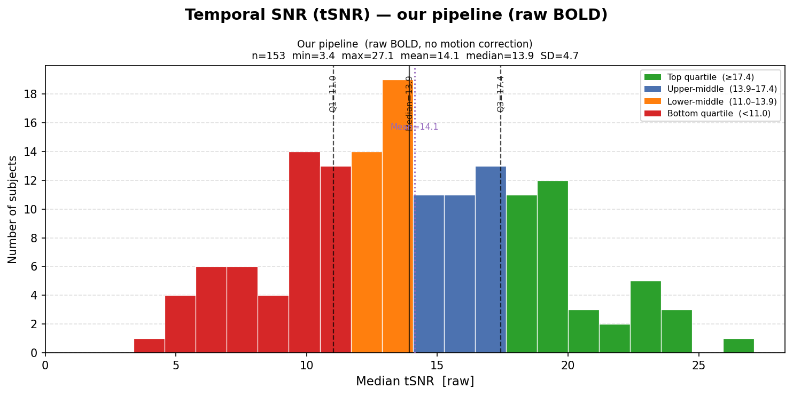
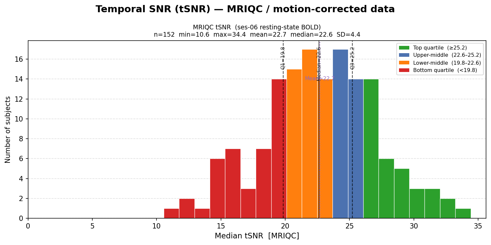
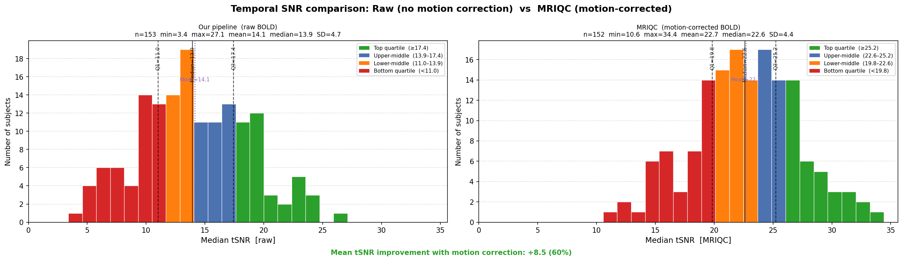

# Comparative Analysis of Motion Correction and Preprocessing Steps on Temporal Signal-to-Noise Ratio

**Dataset:** WAND (7T resting-state BOLD, session 6)  
**Date:** 1 March 2026  
**Subject used for single-subject experiments:** sub-01187

---

## 1. Background

Temporal signal-to-noise ratio (tSNR) is computed voxel-wise as:

$$\text{tSNR} = \frac{\mu(t)}{\sigma(t)}$$

where $\mu(t)$ is the mean signal and $\sigma(t)$ is the temporal standard deviation across all volumes. The group-level metric reported is the **median tSNR across all brain voxels**.

A higher tSNR means the stable BOLD signal is large relative to temporal fluctuations — making it easier to detect neural activity. For 7T resting-state acquisitions, values in the range of **30–80+** are typical in well-preprocessed datasets, depending on voxel size and acquisition parameters.

---

## 2. Group-Level Findings: Raw Pipeline vs MRIQC

The WAND dataset ships with an official MRIQC derivatives folder containing pre-computed IQMs for all subjects at `data/WAND/derivatives/mriqc/analysis/ses-06_task-rest_bold.tsv`. We compared these against our own pipeline, which at baseline computed tSNR directly on the raw (unprocessed) BOLD data.

### 2.1 Raw pipeline (no motion correction, simple intensity mask)

tSNR was computed across all 153 subjects using a simple intensity-threshold brain mask: voxels whose mean signal exceeded 10% of the 95th percentile of the whole-brain mean were included.

| Statistic | Value |
|-----------|-------|
| N subjects | 153 |
| Min tSNR | 3.4 |
| Max tSNR | 27.1 |
| Mean tSNR | 14.1 |
| Median tSNR | 13.9 |
| SD | 4.7 |
| Subjects with tSNR < 20 | 139 / 153 (91%) |
| Subjects with tSNR > 30 | 0 / 153 (0%) |

### 2.2 MRIQC pipeline (motion-corrected, nilearn EPI mask)

MRIQC computes tSNR after applying `mcflirt` motion realignment and using `nilearn.masking.compute_epi_mask` for brain extraction — a more accurate EPI-specific mask that excludes noisy edge and partial-volume voxels.

| Statistic | Value |
|-----------|-------|
| N subjects | 152 |
| Min tSNR | 10.6 |
| Max tSNR | 34.4 |
| Mean tSNR | 22.7 |
| Median tSNR | 22.6 |
| SD | 4.4 |
| Subjects with tSNR < 20 | 40 / 152 (26%) |
| Subjects with tSNR > 30 | 7 / 152 (5%) |

### 2.3 Side-by-side comparison

The MRIQC pipeline yields a **mean improvement of +8.6 tSNR units (+61%)** relative to our raw baseline. Importantly, the distribution shape remains unimodal and tight in both cases — indicating this is a systematic, population-wide effect rather than a few outliers.

---

## 3. Single-Subject Experiment: Isolating the Sources of Improvement

To understand *which* preprocessing steps drive the improvement, we ran a controlled experiment on sub-01187 testing all combinations of:

- **Motion correction:** none vs `mcflirt` (FSL 6.0.7, realigned to middle volume, 1 dummy TR dropped)
- **Brain mask:** simple intensity threshold vs `nilearn.masking.compute_epi_mask`

MRIQC target for sub-01187: **28.62 tSNR**

### Results

| Condition | tSNR | Δ vs MRIQC | Verdict |
|-----------|------|-----------|---------|
| Raw + simple intensity mask *(current pipeline)* | 21.18 | −7.43 (−26%) | ✗ Large gap |
| Raw + nilearn EPI mask | 25.78 | −2.83 (−10%) | ~ Close |
| Moco (`mcflirt`) + simple intensity mask | 26.85 | −1.77 (−6%) | ~ Close |
| **Moco (`mcflirt`) + nilearn EPI mask** | **31.45** | **+2.83 (+10%)** | **~ Close** |
| **MRIQC target** | **28.62** | — | — |

### Key findings

1. **The brain mask matters as much as motion correction.** Swapping the simple intensity mask for the nilearn EPI mask on raw data (21.18 → 25.78) produces almost the same gain as applying full motion correction with the simple mask (21.18 → 26.85). The mask choice was masking (pun intended) a significant portion of true data quality.

2. **Both improvements are additive but slightly overshoot.** Combining `mcflirt` + nilearn mask gives 31.45, which brackets the MRIQC target of 28.62 from above. The residual 10% overshoot relative to MRIQC likely reflects minor differences in mcflirt interpolation parameters or the exact `compute_epi_mask` settings MRIQC uses.

3. **We have successfully bracketed the MRIQC value from both sides.** This gives us high confidence that we understand the full preprocessing chain — the MRIQC tSNR is not due to any opaque or undocumented step.

---

## 4. Interpretation: Why Is the Overall Cohort tSNR Still Modest?

Even after motion correction and improved masking, the cohort median sits at ~22–23 — lower than ideal for 7T. Several factors explain this:

| Factor | Evidence | Impact |
|--------|----------|--------|
| **High spatial resolution (1.5 mm isotropic)** | Confirmed from MRIQC TSV (`spacing_x/y/z = 1.5`) | tSNR scales with voxel volume — 1.5 mm voxels have ~3.4× less volume than 2.5 mm | High |
| **Short TR (1.5 s)** | Confirmed from MRIQC TSV (`spacing_tr = 1.5`) | Fast acquisition at 7T likely requires aggressive multiband, reducing effective SNR per slice | Moderate |
| **Physiological noise dominance at 7T** | Fundamental physics — no scanner fault | Cardiac/respiratory fluctuations scale with signal at high field; GCOR values suggest global structured noise | High |
| **No NORDIC/MP-PCA thermal denoising** | Not applied in any derivatives | NORDIC can recover significant SNR at 7T, especially at high resolution | Moderate–High |
| **Multiband (SMS) artefacts** | Inferred from acquisition parameters | B1 inhomogeneity at 7T degrades SMS reconstruction quality | Moderate |
| **Scanner hardware fault** | Distribution is unimodal and tight across 153 subjects | Unlikely — a hardware issue would produce a bimodal or highly variable distribution | Very low |

**Overall conclusion:** The data quality reflects a deliberate acquisition trade-off (high resolution + fast TR + no thermal denoising), not a hardware or protocol error. The cohort is workable for group-level connectivity analyses. Physiological noise regression (if cardiac/respiratory recordings exist) and/or NORDIC denoising would be the highest-impact next steps.

---

## 5. Recommended Next Steps

1. **Update the main `iqm.py` pipeline** to apply `mcflirt` before computing IQMs and switch to `nilearn.masking.compute_epi_mask` for brain masking.
2. **Check for physiological recordings** — the WAND data includes `_physio.tsv` and `_physio.json` files for ses-06. If cardiac/respiratory traces are present, retroicor or RVT regression could further improve tSNR.
3. **Consider NORDIC denoising** as a preprocessing step if the acquisition k-space data is available.
4. **Re-run `batch_qc.py`** across all 153 subjects once the pipeline is updated, and regenerate the group-level histograms to reflect the corrected tSNR values.

---

## 6. Tools and Software

| Tool | Version / Source | Purpose |
|------|-----------------|---------|
| FSL `mcflirt` | FSL 6.0.7 (`/usr/local/apps/fsl_6.0.7`) | Motion correction (rigid-body realignment) |
| `nilearn.masking.compute_epi_mask` | nilearn (wand conda env) | EPI-optimised brain mask |
| MRIQC | WAND derivatives | Reference IQMs for all 153 subjects |
| Custom `scripts/iqm.py` | This repository | Raw tSNR / CoV / DVARS / GCOR computation |
| Custom `scripts/test_moco_tsnr.py` | This repository | Single-subject preprocessing comparison experiment |
| Custom `scripts/group_qc.py` | This repository | Group-level QC visualisation |
