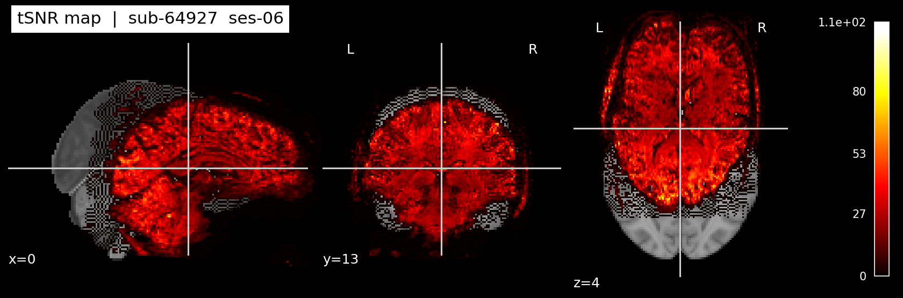
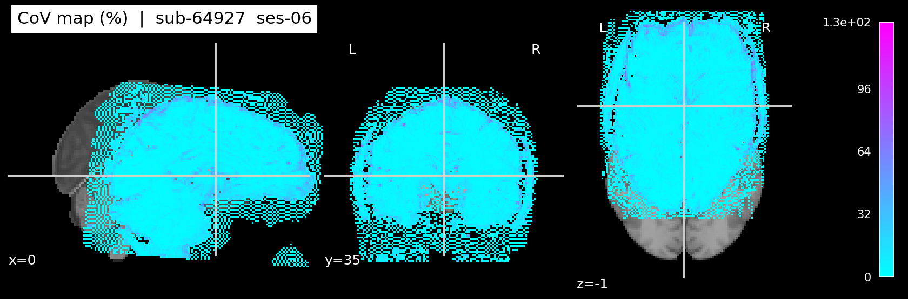
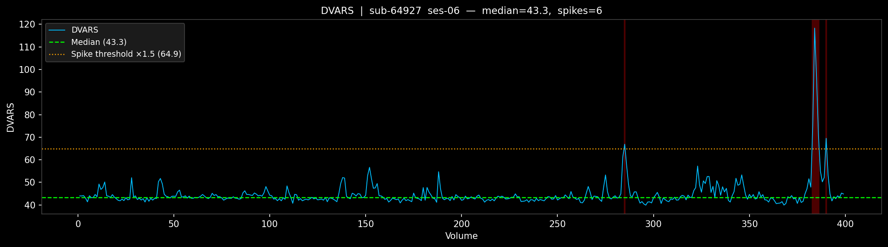

# iqm.py — Image Quality Metrics

## What it does

`iqm.py` computes four **no-reference Image Quality Metrics (IQMs)** from a raw 7T resting-state BOLD scan, following the conventions established by [MRIQC](https://mriqc.readthedocs.io). Unlike `visualise_bold.py` and `slice_qc.py` which produce plots for visual inspection, `iqm.py` produces **numbers** — one set of scalar summaries per subject — that can be tabulated, compared across the group, and reported in a methods section.

All outputs are saved to `results/<subject>/iqm/`.

---

## How to run

```bash
python scripts/iqm.py sub-64927
python scripts/iqm.py sub-64927 --session ses-06
```

---

## Outputs

| File | Type | Contents |
|---|---|---|
| `iqm.json` | JSON | All scalar metrics for this subject |
| `tsnr_map.nii.gz` | 3D NIfTI | tSNR value at every brain voxel |
| `cov_map.nii.gz` | 3D NIfTI | CoV (%) value at every brain voxel |
| `tsnr_map.png` | PNG | Ortho montage of the tSNR map |
| `cov_map.png` | PNG | Ortho montage of the CoV map |
| `dvars.tsv` | TSV | DVARS timeseries — one value per volume |
| `dvars_plot.png` | PNG | DVARS timeseries with spike threshold |

---

## Brain mask

All voxel-level metrics are computed only within a **brain mask** — voxels with a mean signal below 10% of the 95th percentile are excluded. This separates brain tissue from air background without requiring FSL or ANTs, and ensures metrics are not biased by background noise.

```python
mean_vol = data.mean(axis=-1)
thresh   = 0.1 * np.percentile(mean_vol, 95)
mask     = mean_vol > thresh
```

---

## The 4 metrics

---

### 1. Temporal Signal-to-Noise Ratio (tSNR)

$$\text{tSNR}_{xyz} = \frac{\langle S \rangle_t}{\sigma_t}$$

where $\langle S \rangle_t$ is the mean BOLD signal at voxel $(x,y,z)$ across all timepoints, and $\sigma_t$ is the temporal standard deviation at that voxel.

**What it measures:** How far the stable signal component stands above its own temporal fluctuations at each voxel. Think of it as the signal-to-noise ratio in the time domain — higher is better.

**Why it matters:** tSNR directly determines your statistical power to detect BOLD activation or functional connectivity. At 7T, raw tSNR values before preprocessing typically fall in the range 15–40 for resting-state data with 1.5 mm isotropic resolution. After preprocessing (motion correction, physiological noise regression) values of 50–150 are more typical. Low tSNR means any estimated effect size needs to be large to be reliably detected.

**Reported as:** The **median** across brain voxels (not mean — the distribution across voxels is right-skewed, with deep grey matter voxels much higher than cortical edge voxels).

**Also saved as:** `tsnr_map.nii.gz` — the spatial map showing where in the brain tSNR is high or low. Low-tSNR patches at 7T commonly appear near the sinuses, temporal poles, and orbitofrontal cortex due to B0 field inhomogeneity.

**In the code — `compute_tsnr()`:**
```python
mean_t      = data.mean(axis=-1)         # mean across time → (x, y, z)
std_t       = data.std(axis=-1, ddof=1)  # std across time  → (x, y, z)
tsnr_map    = mean_t / std_t             # voxel-wise ratio
tsnr_median = np.median(tsnr_map[mask])  # single summary number
```



**Example values (sub-64927):** `tsnr_median = 17.78`

---

### 2. Coefficient of Variation (CoV)

$$\text{CoV}_{xyz} = \frac{\sigma_t}{\langle S \rangle_t} \times 100\%$$

**What it measures:** CoV is the exact inverse of tSNR, expressed as a percentage. It asks: *what fraction of the measured signal is temporal noise?* A CoV of 5% means 95% of what you're measuring is stable signal. A CoV of 25% means fluctuations are a quarter of the signal level.

**Why it matters:** Unlike raw standard deviation, CoV is normalised by the local mean signal — a crucial point at 7T where signal intensity varies several-fold across the brain due to RF inhomogeneity. Two voxels with the same temporal std but very different mean signals have very different noise properties; CoV captures this while raw std does not.

**Reported as:** The **median** across brain voxels (×100 to express as percentage).

**Relationship to tSNR:** $\text{CoV} = 1/\text{tSNR} \times 100\%$. They carry identical information — both are saved because tSNR is the fMRI convention, while CoV (as a percentage) is the more intuitive metric for quantitative QC reports and non-fMRI audiences.

**In the code — `compute_cov()`:**
```python
cov_map    = 100.0 * std_t / mean_t      # voxel-wise percentage
cov_median = np.median(cov_map[mask])    # single summary number
```



**Example values (sub-64927):** `cov_median = 5.62%`

---

### 3. DVARS

$$\text{DVARS}_t = \sqrt{\frac{1}{N}\sum_{i=1}^{N}\left(x_{i,t} - x_{i,t-1}\right)^2}$$

where $x_{i,t}$ is the signal at brain voxel $i$ at time $t$, and $N$ is the number of brain voxels. This is the RMS (root mean square) of the frame-to-frame signal difference across the brain.

Following Power et al. (2012) and MRIQC convention, the signal is first rescaled so that the grand mean across brain voxels equals **1000** before computing DVARS. This makes the units comparable across subjects and scanners.

**What it measures:** How much the whole-brain signal changed between this volume and the last one. Normally consecutive volumes look nearly identical — DVARS is small. When something goes wrong (a head movement, a scanner instability, a physiological transient), many voxels change simultaneously — DVARS spikes.

**Why it matters:** DVARS is the quantitative version of what you look for in a carpet plot. It gives you a timeseries — one number per TR — so you can see *when* problems occurred, and a spike count that lets you decide whether the data can be cleaned or should be excluded.

**Reported as:**
- `dvars_median` — the median value across all timepoints
- `dvars_n_spikes` — number of frames where DVARS > 1.5 × median

**In the code — `compute_dvars()`:**
```python
brain = data[mask] * (1000.0 / data[mask].mean())  # rescale to grand mean 1000
diff  = np.diff(brain, axis=-1)                    # frame-to-frame difference
dvars = np.sqrt((diff ** 2).mean(axis=0))          # RMS across voxels per frame
```



**Example values (sub-64927):** `dvars_median = 43.30`,  `dvars_n_spikes = 6`

The red shaded regions mark the 6 frames flagged as spikes (>1.5× median). The dashed green line is the median; the dotted orange line is the spike threshold.

---

### 4. Global Correlation (GCOR)

$$\text{GCOR} = \text{Var}\left(\frac{1}{N}\sum_{i=1}^{N} \tilde{x}_i\right)$$

where $\tilde{x}_i$ is the timeseries of voxel $i$ demeaned and normalised to unit variance, and $\text{Var}(\cdot)$ is taken across time. This is equivalent to the mean of all pairwise inter-voxel correlations, following Saad et al. (2013).

**What it measures:** Whether all brain voxels are rising and falling together. In a clean scan, different brain regions fluctuate semi-independently — their pairwise correlations are low and GCOR is small. When there is a global artefact (scanner drift, widespread respiratory signal, shimming failure), voxels throughout the brain move in synchrony — GCOR rises.

**Why it matters:** High GCOR is a red flag that the signal fluctuations you're measuring are largely non-neuronal. This directly contaminates functional connectivity estimates — if everything correlates with everything, your connectivity matrix is dominated by the artefact, not brain organisation.

**Typical range:** A healthy scan typically shows GCOR < 0.05. Values above 0.1 warrant investigation; values above 0.3 suggest severe global contamination.

**In the code — `compute_gcor()`:**
```python
brain   = data[mask]                       # (n_voxels, n_vols)
brain  -= brain.mean(axis=-1, keepdims=True)
brain  /= brain.std(axis=-1, ddof=1, keepdims=True)   # unit variance per voxel
g_u     = brain.mean(axis=0)               # average unit-variance timeseries
gcor    = g_u.var(ddof=1)                  # variance = mean pairwise correlation
```

**Example values (sub-64927):** `gcor = 0.0042` — very low, no global contamination.

---

## The scalar summary file (`iqm.json`)

All metrics are saved together in a single JSON file for easy loading:

```json
{
  "subject": "sub-64927",
  "session": "ses-06",
  "n_voxels_mask": 482562,
  "tsnr_median": 17.78,
  "cov_median": 5.62,
  "dvars_median": 43.3,
  "dvars_n_spikes": 6,
  "dvars_spike_threshold_factor": 1.5,
  "gcor": 0.0042
}
```

Once all subjects are processed, these JSON files can be aggregated into a single group-level table for exclusion decisions and reporting.

---

## Interpreting the metrics together

| Scenario | tSNR | CoV | DVARS spikes | GCOR | Interpretation |
|---|---|---|---|---|---|
| Ideal scan | High | Low | 0–2 | < 0.05 | Include — clean data |
| Motion artefact | Low | High | Many | Low–Med | May exclude or scrub |
| Global drift | Moderate | Moderate | Low | High | Suspect — check carpet plot |
| Signal dropout | Low (regional) | High (regional) | Low | Low | Check coverage in tSNR map |
| Good but noisy | Low | High | Low | Low | Include — may need denoising |

---

## References

- Power et al. (2012). Spurious but systematic correlations in functional connectivity MRI networks arise from subject motion. *NeuroImage*, 59(3), 2142–2154. https://doi.org/10.1016/j.neuroimage.2011.10.018
- Saad et al. (2013). Correcting Brain-Wide Correlation Differences in Resting-State FMRI. *Brain Connectivity*, 3(4), 339–352. https://doi.org/10.1089/brain.2013.0156
- Esteban et al. (2017). MRIQC: Advancing the Automatic Prediction of Image Quality in MRI from Unseen Sites. *PLOS ONE*, 12(9), e0184661. https://doi.org/10.1371/journal.pone.0184661
