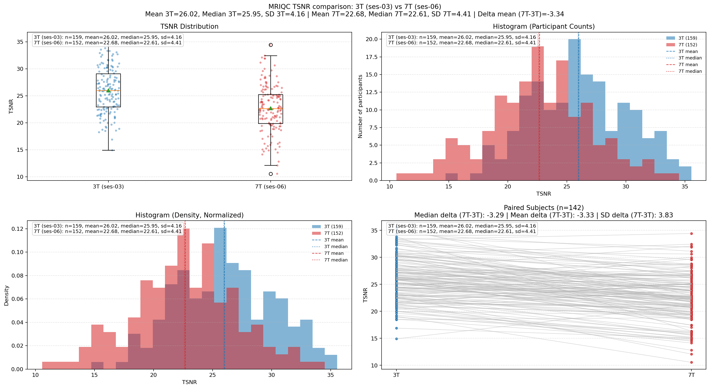
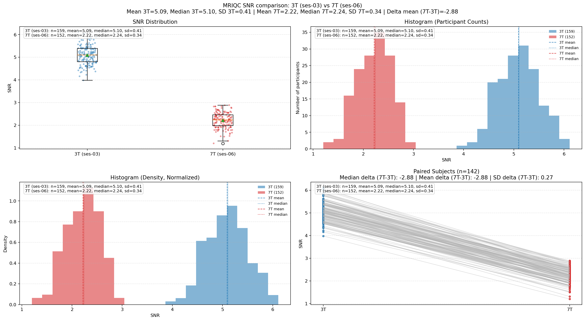

# MRIQC 3T vs 7T Quick Summary (WAND)

Date: 2026-03-13

## What was compared

- 3T resting-state BOLD MRIQC metrics from `ses-03`
- 7T resting-state BOLD MRIQC metrics from `ses-06`
- Source files:
  - `data/WAND/derivatives/mriqc/analysis/ses-03_task-rest_bold.tsv`
  - `data/WAND/derivatives/mriqc/analysis/ses-06_task-rest_bold.tsv`

## Why 3T has more subjects than 7T

MRIQC subject counts are not perfectly matched across sessions:

- `ses-03` (3T): 159 subjects
- `ses-06` (7T): 152 subjects
- Paired overlap (present in both): 142 subjects

Non-overlap:

- 17 subjects are in 3T (`ses-03`) but not in 7T (`ses-06`)
- 10 subjects are in 7T (`ses-06`) but not in 3T (`ses-03`)

Interpretation:

- This is mainly session coverage/dropout across visits (not everyone completed both sessions).
- There are also a few derivative-vs-raw mismatches in the local checkout.

## Metrics summary

### tSNR (MRIQC `tsnr`)

| Group | n | Mean | Median | SD |
|---|---:|---:|---:|---:|
| 3T (`ses-03`) | 159 | 26.020 | 25.953 | 4.155 |
| 7T (`ses-06`) | 152 | 22.684 | 22.613 | 4.411 |
| Paired delta (7T - 3T) | 142 | -3.327 | -3.285 | 3.828 |

### SNR (MRIQC `snr`)

| Group | n | Mean | Median | SD |
|---|---:|---:|---:|---:|
| 3T (`ses-03`) | 159 | 5.094 | 5.103 | 0.414 |
| 7T (`ses-06`) | 152 | 2.218 | 2.237 | 0.337 |
| Paired delta (7T - 3T) | 142 | -2.883 | -2.884 | 0.275 |

## Plots

The updated plots now include:

- Non-normalized histogram (y-axis = number of participants)
- Normalized histogram (y-axis = density)
- Explicit 3T/7T mean, median, and standard deviation values shown directly in the panels

### tSNR plot

### SNR plot

## Output files

- `results/group/mriqc_tsnr_ses-03_vs_ses-06_task-rest.png`
- `results/group/mriqc_tsnr_ses-03_vs_ses-06_task-rest_summary.tsv`
- `results/group/mriqc_tsnr_ses-03_vs_ses-06_task-rest_paired.tsv`
- `results/group/mriqc_snr_ses-03_vs_ses-06_task-rest.png`
- `results/group/mriqc_snr_ses-03_vs_ses-06_task-rest_summary.tsv`
- `results/group/mriqc_snr_ses-03_vs_ses-06_task-rest_paired.tsv`
