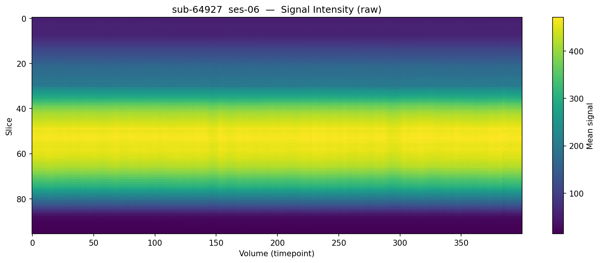
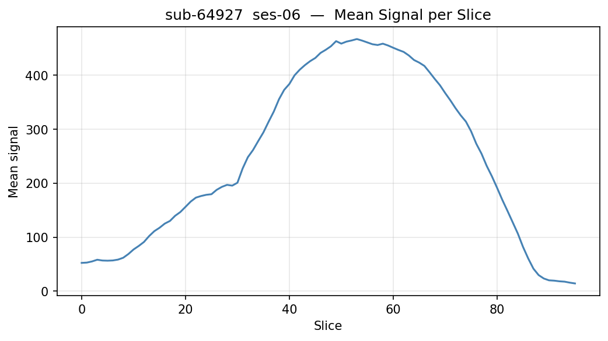
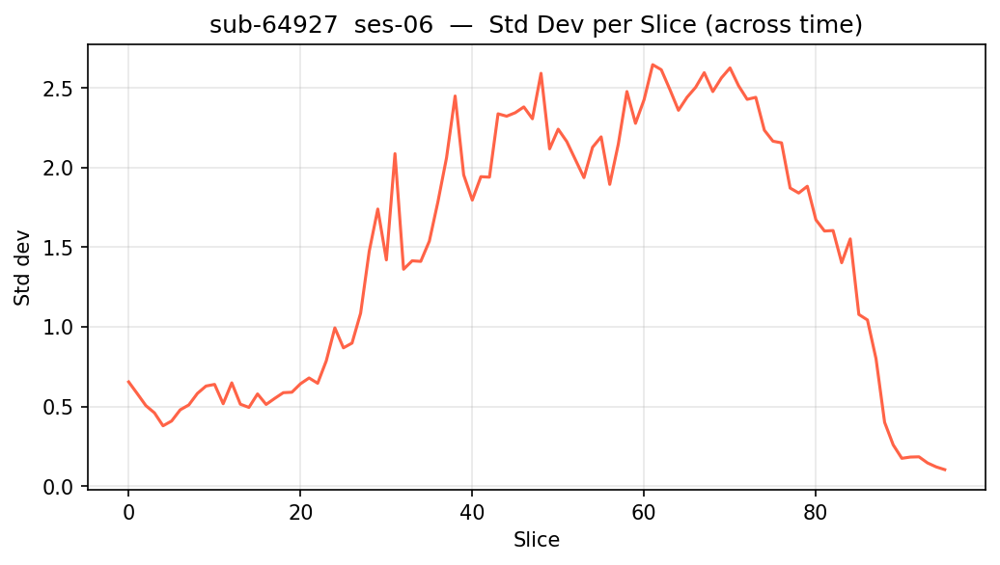
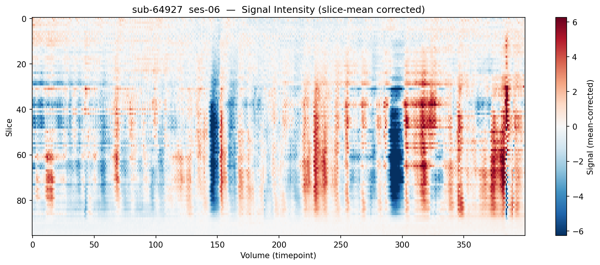
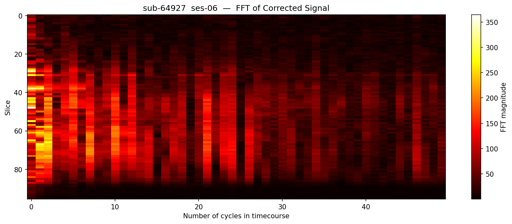

# slice_qc.py — Slice-Based fMRI QC

## What it does

`slice_qc.py` performs **slice-level quality control** on a 7T resting-state BOLD scan. Rather than looking at the whole brain spatially, it reduces each slice at each timepoint to a single number — the mean signal across all voxels in that slice — and then analyses how those numbers behave over time.

This is a Python reimplementation of a standard MATLAB QC script widely used in the field.

It produces 5 plots saved to `results/<subject>/slice_qc/`.

---

## How to run

```bash
python scripts/slice_qc.py sub-43766
python scripts/slice_qc.py sub-43766 --session ses-07
```

---

## Why slice-level QC matters

Spatial QC (see `visualise_bold.py`) tells you whether a brain *looks* right at a given moment. Slice-level QC tells you whether each slice *behaves* consistently over time. This catches a different class of problem:

- **Slice dropout** — a single slice loses signal at certain timepoints (common in EPI due to field drift or motion)
- **Slice-timing artefacts** — one or more slices are systematically offset in signal level from their neighbours
- **Physiological noise** — cardiac (~1 Hz) and respiratory (~0.3 Hz) signals imprint on the data as regular fluctuations, visible in the frequency domain
- **Scanner instability** — gradual signal drift or sudden jumps affect specific slices

These would be missed or hard to interpret in a whole-brain spatial view.

---

## Core concept: the slice-mean matrix

Everything in this script derives from a single 2D matrix:

```
slicemean[volumes × slices]
```

For every timepoint (volume) and every slice, we take the mean signal across all x,y voxels in that slice. This reduces the 4D data (x × y × z × t) to a compact 2D representation that can be visualised and analysed directly.

**In the code — `compute_slicemean()`:**
```python
return data.mean(axis=(0, 1)).T   # mean over x and y → shape [z, t] → transpose → [t, z]
```
`axis=(0, 1)` collapses the x and y spatial dimensions simultaneously. The `.T` transpose puts it in `[volumes × slices]` order for convenience.

---

## The 5 plots

### 1. Raw signal heatmap (`slicemean_raw.png`)



**What it shows:** The slice-mean matrix as a colour image — x-axis is volume (timepoint), y-axis is slice, colour is raw mean signal intensity.

**Why it's useful:** Gives you an immediate global view of signal behaviour. You're looking for:
- **Vertical stripes** = the signal in all slices jumped at the same timepoint → whole-brain motion or scanner spike
- **Horizontal stripes** = one slice has consistently different signal from its neighbours → slice dropout or slice-timing issue
- **Gradual drift** = the colour slowly changes left to right → scanner signal drift over the session

**Example of a problem:** A single bright horizontal stripe at slice 20 that appears for the first 50 volumes then disappears suggests that slice had intermittent dropout.

**In the code — `plot_raw()`:**
```python
im = ax.imshow(slicemean.T, aspect="auto", cmap="viridis", interpolation="none")
```
Note the `.T` here — we transpose to get slices on the y-axis and volumes on the x-axis, matching the MATLAB convention.

---

### 2. Mean signal per slice (`slicemean_mean.png`)



**What it shows:** A line plot where each point is the mean signal in one slice, averaged across all timepoints.

**Why it's useful:** Every slice should have a roughly similar mean signal (brain tissue fills most slices similarly). A sudden dip or spike in the line flags a slice with systematically lower or higher signal. At 7T this often occurs in the inferior-most slices near the base of the skull due to field inhomogeneity.

**Example of a problem:** If slices 5–10 show signal ~30% lower than surrounding slices, that inferior region has signal dropout and data from those slices should be treated with caution.

**In the code — `plot_mean()`:**
```python
mean_per_slice = slicemean.mean(axis=0)   # collapse the volume axis → shape [slices]
ax.plot(mean_per_slice, ...)
```
`axis=0` here averages across volumes (timepoints), leaving one value per slice.

---

### 3. Std dev per slice (`slicemean_std.png`)



**What it shows:** A line plot of how variable each slice's signal is over time.

**Why it's useful:** You expect some variability — neural activity and physiology cause genuine BOLD fluctuations. But you want this to be broadly uniform across slices. A slice with unusually high std dev is fluctuating more than its neighbours, which could mean:
- It's near a large blood vessel and picking up cardiac pulsatility
- Motion is affecting that slice more than others (e.g. brainstem slices near the neck)
- There's a technical problem specific to that slice

**Example of a problem:** If the bottom 5 slices have std dev 3× higher than the rest, they are likely contaminated by neck movement or signal from outside the brain.

**In the code — `plot_std()`:**
```python
std_per_slice = slicemean.std(axis=0)   # std across volumes → shape [slices]
ax.plot(std_per_slice, color="tomato", ...)
```

---

### 4. Slice-mean-corrected heatmap (`slicemean_corrected.png`)



**What it shows:** The same heatmap as plot 1, but with each slice's mean signal subtracted — making the colour represent **deviations from that slice's baseline** rather than absolute signal.

**Why it's useful:** Slices at the top and bottom of the brain naturally have lower signal (less tissue). Without correction, those slices dominate your colour scale and make it hard to see temporal fluctuations within each slice. After correction, the colour encodes only *change over time*, and temporal artefacts (motion spikes, drifts) become much more visible across all slices equally.

This is directly equivalent to the "slice mean corrected" plot in the original MATLAB script.

**In the code — `mean_correct()` and `plot_corrected()`:**
```python
# mean_correct():
sm_t = slicemean.T                              # transpose → [slices × volumes]
return sm_t - sm_t.mean(axis=1, keepdims=True)  # subtract each slice's mean across time

# plot_corrected():
vmax = np.percentile(np.abs(slicemean_norm), 99)   # robust colour scale (ignores outliers)
im = ax.imshow(slicemean_norm, cmap="RdBu_r", vmin=-vmax, vmax=vmax, ...)
```
`keepdims=True` ensures the subtraction broadcasts correctly. The 99th percentile colour scaling prevents a single outlier from washing out the rest of the image.

---

### 5. FFT of corrected signal (`slicemean_fft.png`)



**What it shows:** The frequency content of each slice's corrected timeseries. X-axis = number of cycles across the whole scan duration; y-axis = slice; colour = FFT magnitude (power at that frequency).

**Why it's useful:** Physiological noise has characteristic frequencies. Depending on TR, cardiac noise (~1 Hz) and respiratory noise (~0.3 Hz) alias into the BOLD frequency range. If these appear as bright horizontal bands in the FFT plot, the data has structured physiological noise that will need to be modelled or filtered before analysis. A uniform, diffuse FFT plot is ideal.

**Example of a problem:**
- A bright column at cycle 20 in all slices = a periodic artefact recurring 20 times during the scan → machine vibration or regular head movement
- Bright band in lower slices only at a specific frequency = cardiac pulsatility concentrated near the brainstem/large vessels

**In the code — `plot_fft()`:**
```python
fft_result = np.abs(np.fft.fft(slicemean_norm, axis=1))   # FFT along time axis for each slice
n_cycles   = min(50, fft_result.shape[1] - 1)             # cap at 50 cycles like the MATLAB script
fft_plot   = fft_result[:, 1:n_cycles + 1]                # drop DC component (index 0 = mean)
```
`axis=1` applies the FFT along the volume/time dimension for each slice independently. Index 0 of the FFT is the DC component (the mean signal) which we already removed in the correction step, so we drop it with `[1:n_cycles + 1]`.

---

## Code structure overview

| Function | Purpose |
|---|---|
| `find_bold()` | Locates the NIfTI file and checks it isn't a git-annex pointer |
| `load_bold()` | Loads the 4D array into memory as float32 |
| `save_fig()` | Saves and closes figures consistently |
| `compute_slicemean()` | Core reduction: 4D → 2D slice-mean matrix via vectorised numpy |
| `mean_correct()` | Subtracts each slice's temporal mean to remove baseline differences |
| `plot_raw()` | Heatmap of raw slice means |
| `plot_mean()` | Mean signal per slice (line plot) |
| `plot_std()` | Std dev per slice (line plot) |
| `plot_corrected()` | Heatmap of mean-corrected signal |
| `plot_fft()` | FFT frequency heatmap per slice |
| `main()` | Parses arguments, orchestrates the pipeline |

---

## Relationship to `visualise_bold.py`

The two scripts are complementary, not redundant:

| | `visualise_bold.py` | `slice_qc.py` |
|---|---|---|
| Focus | Spatial patterns across the brain | Temporal behaviour of each slice |
| Best at catching | Signal dropout, motion extent, global spikes | Slice dropout, physiological noise, signal drift |
| Primary question | *Does the brain look right?* | *Does each slice behave consistently over time?* |

Running both on every subject gives the most complete QC picture.
