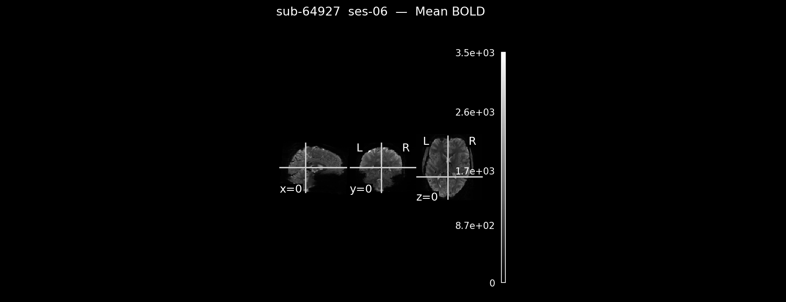
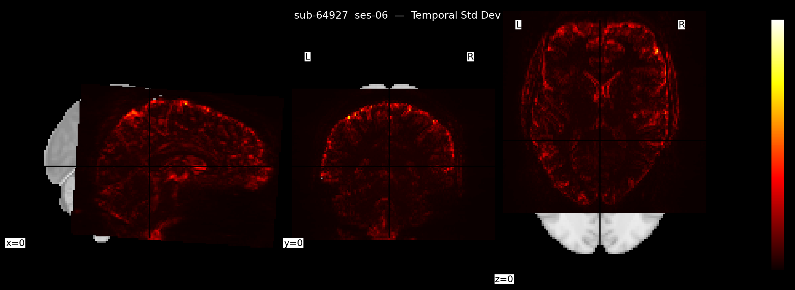
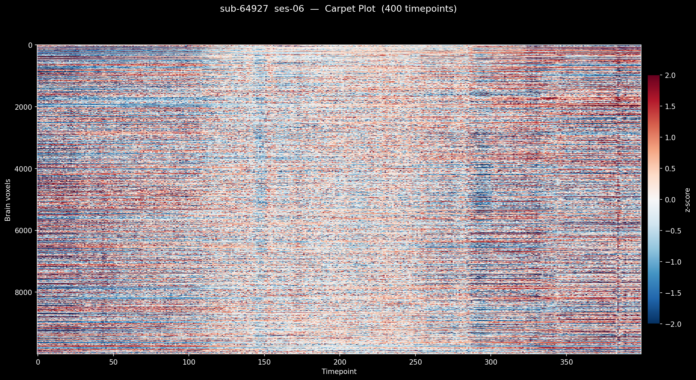
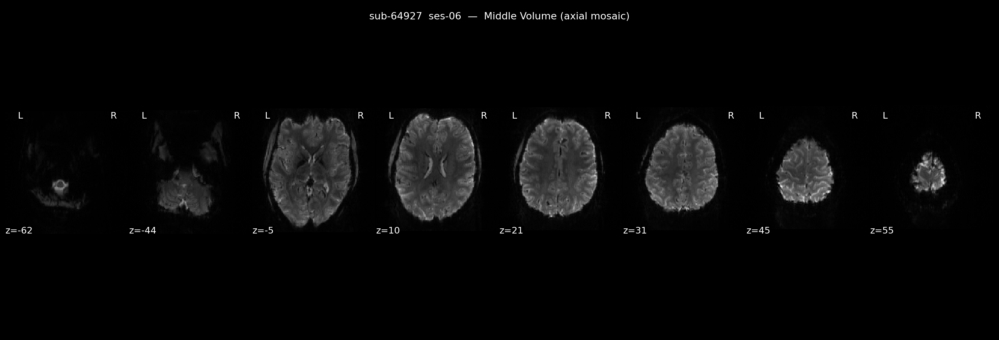

# visualise_bold.py — Spatial BOLD QC

## What it does

`visualise_bold.py` performs **spatial quality control** on a 7T resting-state BOLD scan. It treats the 4D fMRI volume (x × y × z × time) as a whole and asks: *does the brain look right, and is there obvious spatial signal pathology?*

It produces 4 plots saved to `results/<subject>/visualise_bold/`.

---

## How to run

```bash
python scripts/visualise_bold.py sub-43766
python scripts/visualise_bold.py sub-43766 --session ses-07
```

---

## Why spatial QC matters

A 7T resting-state scan takes ~10 minutes and produces hundreds of brain volumes. Before doing any analysis you need to know:

- Is the brain properly covered? Are there signal dropouts near the sinuses or ears (common at 7T)?
- Is there excessive head motion? Motion corrupts connectivity estimates.
- Are there scanner spikes or ghosting artefacts?

Spatial QC answers these questions at a glance, without needing to run preprocessing first.

---

## The 4 plots

### 1. Mean BOLD image (`mean_bold.png`)



**What it shows:** The average signal at every voxel across the entire scan — effectively a structural snapshot of the brain in EPI space.

**Why it's useful:** At 7T, signal dropout near air-tissue interfaces (frontal pole, inferior temporal lobe, orbitofrontal cortex) is common due to field inhomogeneity. The mean image makes these dropout regions immediately visible as dark patches. It's also your reference for checking anatomical coverage — did the FOV cut off any part of the brain?

**Example of a problem:** If you see a large dark region in frontal cortex, data from that region is unusable for connectivity analysis.

**In the code — `plot_mean()`:**
```python
mean_data = data.mean(axis=-1)   # collapse the time axis → 3D mean volume
mean_img  = nib.Nifti1Image(mean_data, affine)  # wrap back into NIfTI for plotting
plotting.plot_epi(mean_img, display_mode="ortho", ...)  # ortho = 3 planes at x=0,y=0,z=0
```
`axis=-1` is the time axis (the 4th dimension). Collapsing it gives you a single 3D image representing the average signal at each voxel.

---

### 2. Temporal Standard Deviation (`std_bold.png`)



**What it shows:** How much each voxel's signal fluctuates over time, shown as a hot-coloured overlay.

**Why it's useful:** In a clean scan, high variability should be concentrated where you expect neural or physiological signal — grey matter and near large blood vessels. If you see high std dev spread diffusely across white matter or in a suspicious ring around the brain edge, it suggests motion artefact. A single very bright patch in an unexpected location can flag a scanner spike.

**Example of a problem:** If the entire brain lights up with high std dev uniformly, the subject moved a lot. If only a small region is bright and it coincides with a major vessel, that's likely normal pulsatile signal.

**In the code — `plot_std()`:**
```python
std_data = data.std(axis=-1)   # std dev across time → 3D volume
std_img  = nib.Nifti1Image(std_data, affine)
plotting.plot_stat_map(std_img, cmap="hot", ...)  # hot colourmap emphasises high values
```
Like the mean, `axis=-1` collapses across time. `plot_stat_map` is used instead of `plot_epi` because it handles the stat-map colouring and threshold display better.

---

### 3. Carpet Plot (`carpet_plot.png`)



**What it shows:** A 2D image where every **row is a brain voxel** and every **column is a timepoint**. Colour encodes the z-scored signal of that voxel at that moment — red = above mean, blue = below mean.

**Why it's useful:** The carpet plot is one of the most powerful fMRI QC visualisations available. It shows the entire 4D dataset compressed into one image:

- **Vertical stripes** (a column goes uniformly red or blue) = the whole brain signal jumped at that timepoint → motion spike or scanner artefact
- **Horizontal bands** = one group of voxels is consistently abnormal → regional dropout or ghosting
- A **clean scan** looks like uniform, uncorrelated noise — no obvious stripes or bands

**Example of a problem:** A scan with lots of head motion will show regular vertical striping. You can count the number of spikes just by looking.

**In the code — `plot_carpet()`:**
```python
flat = data.reshape(-1, nt)                          # flatten x,y,z into one spatial dimension
mask = flat.mean(axis=1) > (0.1 * flat.max())        # remove background voxels (< 10% of max signal)
flat = flat[mask]

mu    = flat.mean(axis=1, keepdims=True)             # mean per voxel across time
sigma = flat.std(axis=1, keepdims=True)              # std per voxel across time
flat_norm = (flat - mu) / sigma                      # z-score each voxel's timeseries

# Downsample to 10,000 rows if needed — otherwise the image is too large to render quickly
if flat_norm.shape[0] > max_rows:
    idx = np.linspace(0, flat_norm.shape[0] - 1, max_rows, dtype=int)
    flat_norm = flat_norm[idx]
```
The background masking step is important — without it, thousands of rows would just be air and obscure the brain signal. The z-scoring normalises each voxel so slices with inherently lower signal (e.g. inferior slices at 7T) don't appear artifically dark.

---

### 4. Middle Volume Mosaic (`middle_volume.png`)



**What it shows:** A single timepoint (the middle one in the scan) displayed as a grid of axial slices.

**Why it's useful:** This is the simplest and most direct QC check — it shows you exactly what the raw images look like. It lets you spot:
- Ghosting (copies of the brain offset in the phase-encode direction)
- Ringing artefacts
- Unusual signal patterns in specific slices
- Whether the brain is centred and orientation is correct

The middle timepoint is used because it avoids any T1-saturation effects at the start of the scan (the first few volumes are often discarded for this reason).

**In the code — `plot_middle_volume()`:**
```python
mid_vol = data[..., data.shape[-1] // 2]   # integer division gives middle timepoint index
mid_img = nib.Nifti1Image(mid_vol, affine)
plotting.plot_epi(mid_img, display_mode="z", cut_coords=8, ...)  # 8 axial slices as a grid
```
`data.shape[-1] // 2` gets the index of the middle volume. `display_mode="z"` with `cut_coords=8` renders 8 equally-spaced axial slices as a mosaic.

---

## Code structure overview

| Function | Purpose |
|---|---|
| `find_bold()` | Locates the NIfTI file and checks it isn't a git-annex pointer |
| `load_bold()` | Loads the 4D array into memory as float32 |
| `save_fig()` | Saves and closes figures consistently |
| `plot_mean()` | Mean image across time |
| `plot_std()` | Temporal standard deviation map |
| `plot_carpet()` | Full carpet plot with z-scoring and downsampling |
| `plot_middle_volume()` | Axial mosaic of the middle timepoint |
| `main()` | Parses arguments, orchestrates the pipeline |
